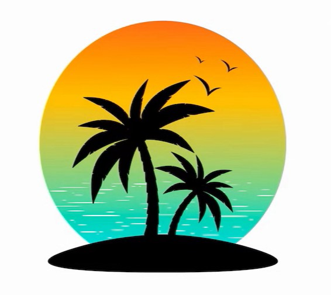

  

<h1 align="center">
  
  
</h1>

<h3 align="center">📊 Big Data & AI Engineer | 🧪 Science Communicator | 🚀 Passionate about Innovation</h3>

  🔭 Currently pursuing a <strong>Master's in Computer Engineering</strong>  
   
  🌱 Exploring new technologies in Machine Learning, Big Data, and DevOps  
   
  💬 Shall we talk about disruptive projects?  
   
  📧 <a href="mailto:brian.1613.bv@gmail.com">brian.1613.bv@gmail.com</a> • 📍 Valencia, Spain

 

  
<kbd>Table of Contents</kbd>

  <ul>
    <li><a href="#project-scope-">Project Scope</a></li>
    <li><a href="#contact-">Contact</a></li>
  </ul>

---

 
  
  ⏩ [My page](http://brivaro.github.io) ⏪ 
  🔴 [Online demo](https://www.youtube.com/watch?v=epTsSGTRUi8) 🔴
  

---

## Project Scope 🧩  

### 🌴 Welcome to my island! 🏝️✨  

Here you will find my **professional portfolio** in an interactive environment built with **Three.js**. 🚀🌊  

#### 🔹 Exploration Mode 👀  
- 📌 **Panoramic (OrbitControls):** View from any angle.  
- 📌 **First-person (FirstPersonControls):** Freely explore the island.  

#### 🔹 Key Features 🎨  
- 🌞 **Realistic shadows** on buildings and terrain.  
- 🗺️ **Interactive menu** with smooth animations (Tween).  
- 📍 **Selectable beacons** using Raycasting.  
- 💦 **Dynamic water** with shaders and sinusoidal waves.  
- 🎇 **Day & night cycle** with lighting effects and fireworks.  
- 🎼 **Immersive soundscape** for an engaging experience.  

#### 💡 Technology Used 🖥️  
- 🚀 **Three.js** for 3D graphics and optimization.  
- 🔷 **EffectComposer, ShaderPass, and RenderPass** for post-processing.  

👉 **Explore, discover, and I challenge you to find me!** 🔍🤔  
🎥 **Online demo**: [YouTube](https://www.youtube.com/watch?v=epTsSGTRUi8)  

This project is solely for educational purposes. It includes materials from the public [Three.js](http://threejs.org) *r140* project, utility libraries from the book *"WebGL Programming Guide" by Kouichi Matsuda and Rodger Lea*, and custom code by *<bvalrod@etsinf.upv.es>*.  

For more information, check out the [wiki](https://github.com/RobVivo/RobVivo.github.io/wiki/INSTRUCCIONES-B%C3%81SICAS).  

To access the portfolio 💼 [load this page](http://brivaro.github.io).  

---

## Contact 📫  

If you’d like to collaborate or learn more about my projects, feel free to reach out:    
📧 [brian.1613.bv@gmail.com](mailto:brian.1613.bv@gmail.com) • 📱 [LinkedIn](https://linkedin.com/in/brian-valiente-rodenas)

 

  

---

🌴 Thank you for visiting my profile!  

💬 I'm always open to new challenges and collaborations!  

---
